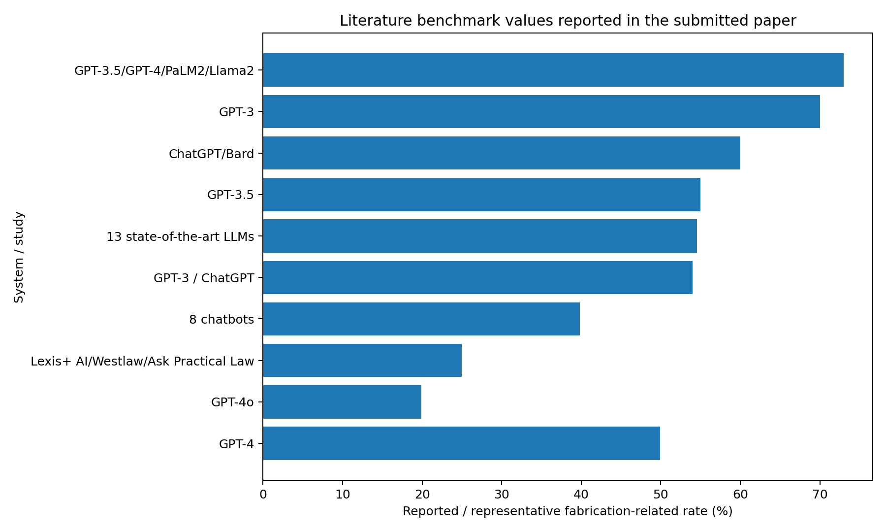

# Awesome Citation Fabrication Benchmark

A curated, verified research repository based on the submitted paper:

> **Benchmarking Citation Fabrication Rates Across Large Language Models and Agentic Search Tools**

The project studies citation fabrication, bibliographic accuracy, citation groundedness, retrieval-augmented generation, and the reliability of agentic/deep-research systems.

## Contents

- [Overview](#overview)
- [AI-Assisted Research Paper](#ai-assisted-research-paper)
- [Citation Integrity Audit](#citation-integrity-audit)
- [Literature Benchmark Results](#literature-benchmark-results)
- [Curated Research Papers](#curated-research-papers)
- [Datasets and Benchmarks](#datasets-and-benchmarks)
- [Tools and Libraries](#tools-and-libraries)
- [GitHub Implementations](#github-implementations)
- [Tutorials and Learning Resources](#tutorials-and-learning-resources)
- [Repository Structure](#repository-structure)
- [How to Extend the Project](#how-to-extend-the-project)
- [Limitations](#limitations)
- [License](#license)

## Overview

Large language models are increasingly used for literature search, writing and research assistance. The central reliability problem is not limited to prose hallucination: models can also produce citations that do not exist, contain incorrect bibliographic metadata, point to the wrong source, or cite a real source that does not support the claim being made. The submitted paper reviews evidence across closed-book LLMs, retrieval-augmented systems, generative search engines, legal research products and deep-research agents.

A key lesson is that **citation existence is only one layer of reliability**. The paper distinguishes fabrication from bibliographic error and from claim-level misgrounding. Agentic search adds further failure stages: retrieval failure, ranking/filtering failure, generation failure, URL failure and publisher-access constraints. Consequently, comparing one headline “hallucination rate” across unrelated studies can be misleading.

The repository turns the paper into a reusable research resource: it preserves the paper, audits all 23 bibliography entries, organizes 20 scholarly papers, collects relevant benchmarks and tools, and documents reproducible GitHub implementations. The literature results are clearly labelled as **reported results from prior studies**, not fabricated experiments performed in this repository.

## AI-Assisted Research Paper

**Title:** Benchmarking Citation Fabrication Rates Across Large Language Models and Agentic Search Tools

The paper is included in both editable and PDF form:

- [PDF](paper/AI_Assisted_Research_Paper.pdf)
- [DOCX](paper/AI_Assisted_Research_Paper.docx)

## Citation Integrity Audit

The submitted paper contains **23 bibliography entries**.

| Audit result | Count |
|---|---:|
| Valid | 22 |
| Partially valid / metadata error | 1 |
| Fabricated | 0 |
| Total | 23 |

**Strict fabrication rate of the paper's own bibliography: 0.00%.**

**Material metadata-error rate: 4.35%.**

The one partial case is important: the cited DOI/title correspond to a real 2026 article, but the paper gave the wrong authors. This demonstrates why DOI-existence checking alone is insufficient.

- [Full audit](citation-audit/Citation_Integrity_Audit.md)
- [Machine-readable audit CSV](data/citation_audit_23_references.csv)

## Literature Benchmark Results

The paper's literature table reports wide variation. Examples include:

- GPT-3.5: **55%** fabricated citations in Walters & Wilder.
- GPT-4: **18%** in the same study.
- GPT-4o: **19.9%** overall in Linardon et al.
- Eight-chatbot bibliographic retrieval study: **39.8%** erroneous or fabricated references.
- Legal RAG products: **17–33%** hallucination in Magesh et al.
- GhostCite: **14.23–94.93%** across 13 LLMs and 40 domains.

These values are **not directly pooled** because the underlying studies use different prompts, domains, models, definitions and verification methods.



See:

- [Literature benchmark CSV](data/literature_benchmark.csv)
- [Interpretation](results/literature_benchmark_results.md)

## Curated Research Papers

The repository contains **20 scholarly papers** selected directly from the submitted paper's bibliography and grouped by research purpose.

See [references/references.md](references/references.md).

## Datasets and Benchmarks

- ALCE
- DeepResearch Bench
- AuthorityBench
- LegalCiteBench
- HalluLens

See [datasets/datasets.md](datasets/datasets.md).

## Tools and Libraries

- Crossref
- OpenAlex
- DOI
- PubMed
- urlhealth
- CiteVerifier / GhostCite
- ALCE

See [tools/tools.md](tools/tools.md).

## GitHub Implementations

Seven relevant implementations are documented, including:

- Microsoft hallucinated-references
- Princeton NLP ALCE
- Facebook Research HalluLens
- AuthorityBench
- DeepResearch Bench
- GhostCite/CiteVerifier
- urlhealth

See [implementations/github-repositories.md](implementations/github-repositories.md).

## Tutorials and Learning Resources

The repository provides authoritative documentation for Crossref, OpenAlex, DOI, ALCE, HalluLens, DeepResearch Bench and urlhealth.

See [tutorials/tutorials.md](tutorials/tutorials.md).

## Repository Structure

```text
awesome-citation-fabrication-benchmark/
├── README.md
├── paper/
│   ├── AI_Assisted_Research_Paper.pdf
│   └── AI_Assisted_Research_Paper.docx
├── citation-audit/
│   └── Citation_Integrity_Audit.md
├── references/
│   └── references.md
├── datasets/
│   └── datasets.md
├── tools/
│   └── tools.md
├── implementations/
│   └── github-repositories.md
├── tutorials/
│   └── tutorials.md
├── data/
│   ├── citation_audit_23_references.csv
│   ├── audit_summary.json
│   ├── literature_benchmark.csv
│   └── project_metadata.md
├── results/
│   └── literature_benchmark_results.md
├── figures/
│   └── literature_benchmark_rates.png
├── COMMIT_PLAN.md
└── LICENSE
```

## How to Extend the Project

The next stage is a controlled primary benchmark.

### 1. Select systems

Separate:
- closed-book LLMs;
- retrieval-augmented chat systems;
- agentic/deep-research systems.

### 2. Use identical prompts

Use the same research prompts and request the same number of citations.

### 3. Save raw outputs

Record model version, date, prompt and raw response.

### 4. Parse citations

Extract:
`title | authors | year | venue | DOI | URL`

### 5. Verify

Check:
- existence;
- title;
- authors;
- year;
- venue;
- DOI;
- URL identity;
- claim-level support.

### 6. Score

At minimum:

```text
Fabrication rate = fabricated / total × 100
Metadata error rate = partial / total × 100
Validity rate = valid / total × 100
```

For agents, separately measure URL non-resolution and stale-vs-hallucinated URLs.

### 7. Compare

Compare systems only when the benchmark conditions are genuinely comparable.

## Limitations

- Published studies use different operational definitions.
- Model versions change quickly.
- Domains and prompts can strongly affect results.
- A real citation may still be irrelevant to the claim.
- A dead URL is not automatically a fabricated citation.
- Retrieval systems combine retrieval, ranking and generation, so a single error rate can hide several causal stages.
- This repository intentionally does not invent new model-run results.

## License

Original repository documentation is released under the MIT License. Third-party papers and repositories remain under their own licenses; this repository links to them rather than redistributing copyrighted PDFs.
